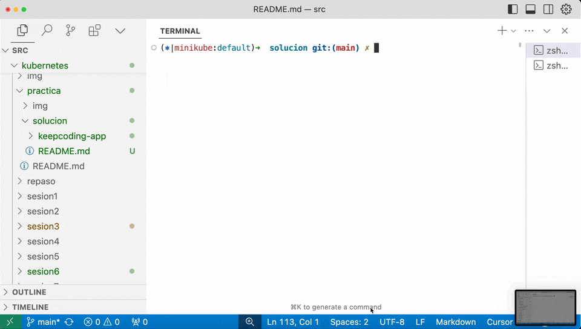

# KeepCoding App Helm Chart

Chart de Helm para desplegar una aplicación FastAPI con una base de datos en Kubernetes.

## Tabla de Contenidos

- [TL;DR](#tldr)
- [Prerequisitos](#prerequisitos)
- [Introducción](#introducción)
- [Valores de Configuración](#valores-de-configuración)
- [Configuración de Autenticación de la Base de Datos](#configuración-de-autenticación-de-la-base-de-datos)
- [Configuración de autoescalado](#configuración-de-autoescalado)
- [Exposición de la aplicación al exterior](#exposición-de-la-aplicación-al-exterior)
- [Persistencia de Datos](#persistencia-de-datos)
- [Resiliencia de la Aplicación](#resiliencia-de-la-aplicación)
- [Evidencia Visual](#evidencia-visual)

## TL;DR

```bash
kubectl create namespace keepcoding-app
helm install keepcoding-app ./keepcoding-app \
  --set mariadb.auth.rootPassword=my_user \
  --set mariadb.auth.password=my_password \
  --set mariadb.auth.user=my_user \
  --namespace keepcoding-app
```

## Prerequisitos

- Tener instalado [Helm](https://helm.sh/docs/intro/install/).
- Tener acceso a un clúster de Kubernetes. Se puede usar [Minikube](https://minikube.sigs.k8s.io/docs/start/).

## Introducción

Este chart de Helm despliega una aplicación FastAPI con una base de datos MariaDB en Kubernetes. La aplicación FastAPI se conecta a la base de datos MariaDB para almacenar los datos. El chart de Helm crea los siguientes recursos en Kubernetes:

- **Deployment**: Despliega la aplicación FastAPI.
- **Horizontal Pod Autoscaler (HPA)**: Escala la aplicación FastAPI en base al uso de CPU.
- **Ingress**: Expone la aplicación FastAPI al exterior.
- **Secrets**: Almacenan las credenciales de la base de datos para la aplicación FastAPI y la base de datos MariaDB.
- **Service**: Permite la comunicación con las instancias de la aplicación FastAPI.
- **Headless Service**: Permite la comunicación con las instancias de la base de datos MariaDB.
- **Persistent Volume Claim (PVC)**: Solicita almacenamiento persistente para la base de datos MariaDB.
- **StatefulSet**: Despliega la base de datos MariaDB.

## Valores de Configuración

El chart de Helm permite configurar los siguientes valores:

| Parámetro | Descripción | Tipo | Valor por Defecto |
|-----------|-------------|------|-------------------|
| `app.replicaCount` | Número de réplicas de la aplicación FastAPI (Sólo aplica si `app.autoscaling.enabled` es `false`) | int | `2` |
| `app.image.repository` | Repositorio de la imagen de la aplicación FastAPI | string | `ghcr.io/ohmyplatform/fastapi-mariadb` |
| `app.image.tag` | Tag de la imagen de la aplicación FastAPI | string | `main` |
| `app.image.pullPolicy` | Política de descarga de la imagen de la aplicación FastAPI | string | `IfNotPresent` |
| `app.ingress.enabled` | Habilita el Ingress para la aplicación FastAPI | bool | `true` |
| `app.ingress.host` | Host del Ingress para la aplicación FastAPI | string | `keepcoding-127-0-0-1.nip.io` |
| `app.ingress.path` | Path del Ingress para la aplicación FastAPI | string | `/` |
| `app.ingress.annotations` | Anotaciones del Ingress para la aplicación FastAPI | object | `{}` |
| `app.resources.limits.cpu` | Límite de CPU para la aplicación FastAPI | string | `100m` |
| `app.resources.limits.memory` | Límite de memoria para la aplicación FastAPI | string | `128Mi` |
| `app.resources.requests.cpu` | CPU solicitada para la aplicación FastAPI | string | `50m` |
| `app.resources.requests.memory` | Memoria solicitada para la aplicación FastAPI | string | `64Mi` |
| `app.autoscaling.enabled` | Habilita el escalado automático de la aplicación FastAPI | bool | `true` |
| `app.autoscaling.minReplicas` | Número mínimo de réplicas de la aplicación FastAPI | int | `2` |
| `app.autoscaling.maxReplicas` | Número máximo de réplicas de la aplicación FastAPI | int | `5` |
| `app.autoscaling.targetCPUUtilizationPercentage` | Porcentaje de uso de CPU para escalar la aplicación FastAPI | int | `70` |
| `mariadb.image.repository` | Repositorio de la imagen de la base de datos MariaDB | string | `mariadb` |
| `mariadb.image.tag` | Tag de la imagen de la base de datos MariaDB | string | `10.5` |
| `mariadb.image.pullPolicy` | Política de descarga de la imagen de la base de datos MariaDB | string | `IfNotPresent` |
| `mariadb.auth.database` | Nombre de la base de datos MariaDB | string | `courses_db` |
| `mariadb.auth.rootPassword` | Contraseña del usuario `root` de la base de datos MariaDB | string | |
| `mariadb.auth.password` | Contraseña del usuario de la base de datos MariaDB | string | |
| `mariadb.auth.user` | Nombre del usuario de la base de datos MariaDB | string | |
| `mariadb.persistence.size` | Tamaño del almacenamiento persistente para la base de datos MariaDB | string | `1Gi` |

## Configuración de Autenticación de la Base de Datos

El chart de Helm crea un secreto en Kubernetes con las credenciales de la base de datos MariaDB. Las credenciales son valores sensibles que no deben ser expuestos en un repositorio. Para configurar las credenciales de la base de datos MariaDB, se pueden utilizar argumentos `--set` al instalar / actualizar el chart de Helm o un fichero `secrets.yaml` con los valores de las credenciales que NO subiremos al repositorio.

```bash
helm install keepcoding-app ./keepcoding-app \
  --set mariadb.auth.rootPassword=my_user \
  --set mariadb.auth.password=my_password \
  --set mariadb.auth.user=my_user
```

```diff
  mariadb:
+   auth:
+     rootPassword: my_user
+     password: my_password
+     user: my_user
```

## Configuración de autoescalado

El chart de Helm permite configurar el autoescalado de la aplicación FastAPI en base al uso de CPU. Por defecto, la aplicación FastAPI escalará cuando supere el 70% de uso de CPU. Los valores de autoescalado se pueden ajustar en el fichero `values.yaml`.

```diff
app:
+  autoscaling:
+    enabled: true
+    minReplicas: 2
+    maxReplicas: 5
+    targetCPUUtilizationPercentage: 70
```

## Exposición de la aplicación al exterior

El chart de Helm expone la aplicación FastAPI al exterior mediante un Ingress. El Ingress se configura con un host y un path que se pueden ajustar en el fichero `values.yaml`.

```diff
app:
+  ingress:
+    enabled: true
+    host: keepcoding-127-0-0-1.nip.io
+    path: /
```

## Persistencia de Datos

El chart de Helm solicita almacenamiento persistente para la base de datos MariaDB. El tamaño del almacenamiento persistente se puede ajustar en el fichero `values.yaml`.

```diff
mariadb:
+  persistence:
+    size: 1Gi
```

## Resiliencia de la Aplicación

El chart de Helm garantiza la resiliencia de la aplicación mediante el uso de un livenessProbe y un readinessProbe. Si la aplicación no responde correctamente, Kubernetes reiniciará el contenedor automáticamente. Si la aplicación no está lista para recibir tráfico, Kubernetes no enviará tráfico a los PODs que no responden correctamente.

## Evidencia Visual

Se muestra cómo se despliega la aplicación usando el chart de Helm en Minikube. Se puede ver cómo se crean los recursos y cómo se expone la aplicación FastAPI al exterior. Se puede ver cómo utilizamos cURL para crear un curso y cómo lo recuperamos.


