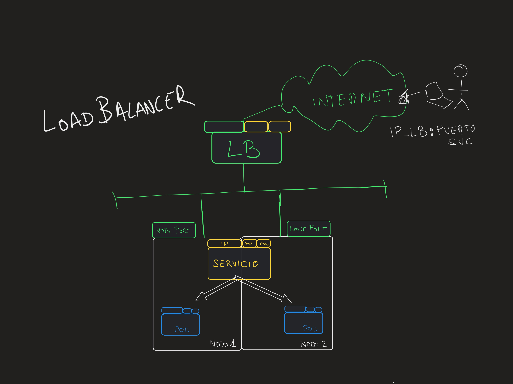

# Services

En esta demostración:
* [Creación deployment](#creación-del-deployment)
* [ClusterIP](#clusterip)
* [NodePort](#nodeport)
* [LoadBalancer](#loadbalancer)
* [HeadLess](#headless)

Para demostrar los diferentes tipos de servicios utilizaremos:
- `Deployment nginx` con 2 réplicas.
- `Pod` simple para actuar como cliente dentro del cluster con `busybox:1.28`
- Objeto `Service` que iremos modificando.

## Creación del deployment
Comenzamos creando el deployment, cuya definición (comentada) es similar a:

```yaml
apiVersion: apps/v1 # Version de la API (puede cambiar entre versiones de k8s)
kind: Deployment  # TIPO: Deployment
metadata: # Metadatos del Deployment
  name: nginx-deployment
  labels:
    app: nginx-dep # este label existe a nivel de deployment
spec: # Spec del DEPLOYMENT
  selector:
    matchLabels:
      app: nginx
  replicas: 2 # indica al controlador que ejecute 2 pods
  template: # Aquí comienza el bloque del POD
    metadata: # Metadatos del POD
      labels:  # Labels del POD (distintos a los del deployment!)
        app: nginx
    spec: # Especificación del POD
      containers: # Declaración de los contenedores del POD
      - name: nginx
        image: nginx
        ports:
        - containerPort: 80
```

Para crear el deployment:

```shell
kubectl apply -f 01-deployment.yaml
```

Una vez creado podemos verificar que esté corriendo y los logs de los pods asociados con:

```shell
kubectl get pod
kubectl logs nginx-deployment-xxxxxx (# el nombre de uno de los pods )
```

A continuación crearemos el servicio cuya definición será similar a:

```yaml
apiVersion: v1
kind: Service
metadata:
  name: nginx # Nombre DNS del servicio
spec:
  type: ClusterIP  # TIPO (lo iremos cambiando)
  selector: # SELECTOR DE PODS (ENDPOINTS FINALES DEL SERVICIO)
    app: nginx
  ports: # Puertos que abre el servicio
  - protocol: TCP
    port: 80 # Puerto de escucha del servicio. PODEMOS ELEGIRLO.
    targetPort: 80  # Puerto de escucha del pod. HA DE SER EL CORRECTO.
```

**CONSIDERACIONES IMPORTANTES**

* Selector: es un selector de __pods exclusivamente__. Ha de apuntar a labels de pods y no de Deployments, Statefulsets, etc.
* Puertos: el puerto de escucha podemos elegirlo, el `targetPort` ha de ser exactamente en el que escuchan los pods de destino.
* Se pueden crear múltiples puertos en un servicio (un pod puede escuchar en varios puertos también).
* Nombre: el nombre del servicio será el nombre DNS que usarán los clientes internos.

### ClusterIP
- Servicio `ClusterIP`: proporciona acceso interno a otros pods del cluster. No es accesible desde el exterior.


```shell
kubectl apply -f 02-clusterip.yaml
```

Para conocer los detalles del servicio:
```shell
kubectl get service nginx -o=wide
kubectl describe service nginx
```

__Probando acceso a servicio ClusterIP__

Como el servicio ClusterIP es accesible solo desde dentro del cluster nos crearemos un `pod cliente` de prueba. Posibles imágenes (busybox:1.28, quay.io/curl/curl, etc.).

```shell
kubectl run -i --tty --rm debug --image=quay.io/curl/curl --restart=Never -- sh
```

Una vez dentro podremos comprobar la resolución y conexión con el servicio:

```console
$ nslookup nginx
Server:    10.56.0.10
Address 1: 10.56.0.10 kube-dns.kube-system.svc.cluster.local

Name:      nginx
Address 1: 10.56.9.59 nginx.default.svc.cluster.local

$ curl nginx
<!DOCTYPE html>
<html>
<head>
<title>Welcome to nginx!</title>
<style>
    body {
        width: 35em;
        margin: 0 auto;
        font-family: Tahoma, Verdana, Arial, sans-serif;
    }
...
```

__Comprobación NAT (SNAT / DNAT) y flujo de tráfico__

- Echa un vistazo tanto al pod cliente, a los pods de nginx y al servicio para conocer las direcciones IP de todos los componentes (`kubectl get`).
- Mira los logs de nginx mientras realizas pruebas para verificar la IP de origen del paquete que llega a nginx.
- Comprobarás que en el tráfico interno no se realiza `SNAT`, ya que el pod de destino recibe la IP de origen del pod cliente.
- `DNAT` es implementado por el servicio para poder hacer llegar el tráfico al pod de destino.

IP del pod cliente:
```shell
[ root@curl-test:/ ]$ ip a
    inet 10.52.2.4/24 brd 10.52.2.255 scope global eth0
```

Logs de NGINX tras el curl desde el pod cliente:
```shell
10.52.2.4 - - [05/Feb/2022:08:52:30 +0000] "GET / HTTP/1.1" 200 612 "-" "curl/7.35.0" "-"
```

### NodePort
Servicio `NodePort`: proporciona acceso externo a los pods abriendo un puerto del rango `30000-32767` en todos los nodos del cluster.


```shell
kubectl apply -f 03-nodeport.yaml
```

Una vez creado habrá que comprobar el NodePort (__asignado automáticamente si no se indica en el manifest del servicio__):

```
$ kubectl get service nginx -o=wide
NAME    TYPE       CLUSTER-IP   EXTERNAL-IP   PORT(S)        AGE     SELECTOR
nginx   NodePort   10.56.9.59   <none>        80:31706/TCP   9m44s   app=nginx
```

En nuestro caso el puerto abierto en los hosts de kubernetes es el `31706`.

__Probando acceso a servicio NodePort__

El servicio NodePort abre un puerto en todos los nodos de nuestro cluster de Kubernetes. Para probarlo tendremos que conectarnos a ellos.

En minikube podemos hacerlo con:

```shell
# si hemos creado el servicio en un namespace específico añadir -n <namespace>
minikube service nginx --url 
```

Esto abrirá un tunel al puerto del servicio debido a las limitaciones del driver de docker puesto que la IP no es accesible directamente (más información [aquí](https://minikube.sigs.k8s.io/docs/handbook/accessing/)).

Si tus máquinas de Kubernetes están en la nube recuerda que tendrás que asegurarte de abrir el puerto en las reglas del firewall / security group o similar.

Por ejemplo en GKE:

```shell
gcloud compute firewall-rules create test-node-port --allow tcp:31706

# OJO!!! El comando anterior abre ese puerto para todas las máquinas del VPC!!!
```

Una vez asegurado que el tráfico será permitido simplemente nos conectaremos desde nuestro navegador (o shell vía curl) al destino. Para ello necesitaremos saber las direcciones IP reales de nuestros nodos. Una forma de obtenerlas es:

```shell
$ kubectl get nodes -o=wide
NAME                                        STATUS   ROLES    AGE   VERSION            INTERNAL-IP   EXTERNAL-IP     OS-IMAGE                             KERNEL-VERSION   CONTAINER-RUNTIME
gke-keepcoding-default-pool-5a194f9d-nprx   Ready    <none>   18m   v1.21.6-gke.1500   10.138.0.2    35.230.29.12    Container-Optimized OS from Google   5.4.144+         containerd://1.4.8
gke-keepcoding-default-pool-5a194f9d-phgm   Ready    <none>   18m   v1.21.6-gke.1500   10.138.0.4    34.82.250.102   Container-Optimized OS from Google   5.4.144+         containerd://1.4.8
gke-keepcoding-default-pool-5a194f9d-w0r2   Ready    <none>   18m   v1.21.6-gke.1500   10.138.0.3    35.247.71.42    Container-Optimized OS from Google   5.4.144+         containerd://1.4.8
```

En este ejemplo, las direcciones accesibles son las indicadas en la columna `EXTERNAL-IP`. Comprobamos que todas ellas permiten el tráfico y funcionan (__independientemente de que tengan pod corriendo en el nodo o no__):

```
curl http://35.230.29.12:31706
curl http://34.82.250.102:31706
curl http://35.247.71.42:31706
```

__Comprobación SNAT (IP origen)__

- En este caso veremos que la __IP de origen__ que detecta NGINX __no es la IP del cliente__, sino una IP interna del cluster (del nodo que manejó el tráfico), por lo que comprobamos que en el acceso externo __sí__ se implementa `SNAT` para el tráfico. Generalmente esto no es problema porque la IP del cliente se añade como cabecera HTTP.

```
10.52.0.1 - - [05/Feb/2022:09:03:38 +0000] "GET / HTTP/1.1" 200 612 "-" "curl/7.79.1" "-"
10.138.0.3 - - [05/Feb/2022:09:31:09 +0000] "GET / HTTP/1.1" 200 612 "-" "curl/7.79.1" "-"
10.138.0.4 - - [05/Feb/2022:09:31:17 +0000] "GET / HTTP/1.1" 200 612 "-" "curl/7.79.1" "-"
```

### LoadBalancer
Servicio `LoadBalancer`: Proporciona acceso externo a los pods creando un LoadBalancer externo.



```
kubectl apply -f 04-loadbalancer.yaml
```

⚠️ Lo siguente solo aplica si estáis en un entorno en la nube (GKE, EKS, AKS, etc.). En minikube necesitamos ejecutar `minikube tunnel` para que funcione.

__Probando acceso a servicio LoadBalancer__

La creación del load balancer puede tardar unos minutos. Esperaremos a que la IP esté disponible y la obtendremos observando el servicio:

```
$ kubectl get service nginx
NAME    TYPE           CLUSTER-IP   EXTERNAL-IP     PORT(S)        AGE
nginx   LoadBalancer   10.56.9.59   35.230.69.103   80:31706/TCP   46m
```

Comprobamos acceso:
```
curl http://35.230.69.103
```

__Comprobación NAT__

Vermos que es igual que en el caso de `NodePort`. Al tráfico externo se le aplica `SNAT` y la IP de origen recibida en el destino no es la del cliente, sino la del nodo que procesa el tráfico.

Logs de NGINX similares a los anteriores:

```
10.138.0.4 - - [05/Feb/2022:09:34:55 +0000] "GET / HTTP/1.1" 200 612 "-" "curl/7.79.1" "-"
10.138.0.4 - - [05/Feb/2022:09:34:57 +0000] "GET / HTTP/1.1" 200 612 "-" "curl/7.79.1" "-"
10.52.0.1 - - [05/Feb/2022:09:34:59 +0000] "GET / HTTP/1.1" 200 612 "-" "curl/7.79.1" "-"
```

### HeadLess

Servicio `HeadLess`: Proporciona acceso interno pero sin balancear, directamente se resuelve a nivel DNS a las IPs de todos los endpoints. `HeadLess` no existe como `type` de servicio, sino que es un `ClusterIP` con la propiedad `clusterIP: None`.


- Para esta prueba creamos un servicio nuevo con nombre `nginx-headless`:

```yaml
apiVersion: v1
kind: Service
metadata:
  name: nginx-headless
spec:
  type: ClusterIP
  clusterIP: None
  selector:
    app: nginx
  ports:
  - protocol: TCP
    port: 80
    targetPort: 80
```

Lo creamos:

```shell
kubectl apply -f 05-headless.yaml
```

Echa un vistazo al servicio y comprueba que no tiene dirección IP asociada.

__Probando acceso a servicio headless__

Como en el caso de `ClusterIP` utilizaremos un cliente interno:

```shell
kubectl run -i --tty --rm debug --image=quay.io/curl/curl --restart=Never -- sh

$ nslookup nginx-headless
Server:    10.56.0.10
Address 1: 10.56.0.10 kube-dns.kube-system.svc.cluster.local

Name:      nginx-headless
Address 1: 10.52.0.4
Address 2: 10.52.2.3

$ curl 10.52.0.4
$ curl 10.52.2.3
```

En este caso __la comunicación es directa pod a pod, kube-proxy no está involucrado__. Tampoco existe NAT de ningún tipo (ni `DNAT` ni `SNAT`).

Logs del NGINX: muestran la IP origen del pod cliente como podemos esperar.

```shell
10.52.2.5 - - [05/Feb/2022:09:52:12 +0000] "GET / HTTP/1.1" 200 612 "-" "curl/7.35.0" "-"
```
